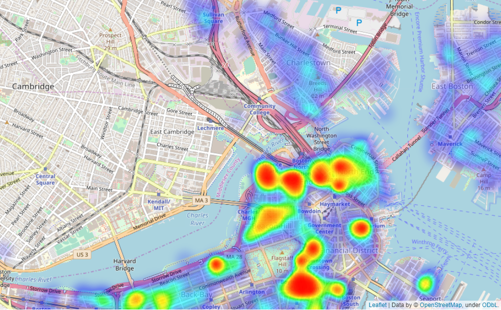

# Boston Airbnb analysis

A simple analysis of  the boston airbnb housing data which was used for a medium blogpost

### The following libaries were used in this project:
*Dataexploration and visualization*
- numpy 
- pandas 
- matplotlib
- seaborn
- re
- pandas_profiling

*tqdm for visualizing the apply process in the notebook.*
- tqdm 

## the map was created with folium and the heatmap plugin
- folium

## for analyzing the calendar data
- datetime
- calendar -> day name e.g monday,tuesday, etc.
- holidays -> to get us holidays like laborday, columbus day, independence day.

## sklearn and xgboost for modeling
- LinearRegression
- train_test_split
- r2_score, mean_squared_error
- tree
- xgboost

Data can be downloaded from http://insideairbnb.com/get-the-data.html
